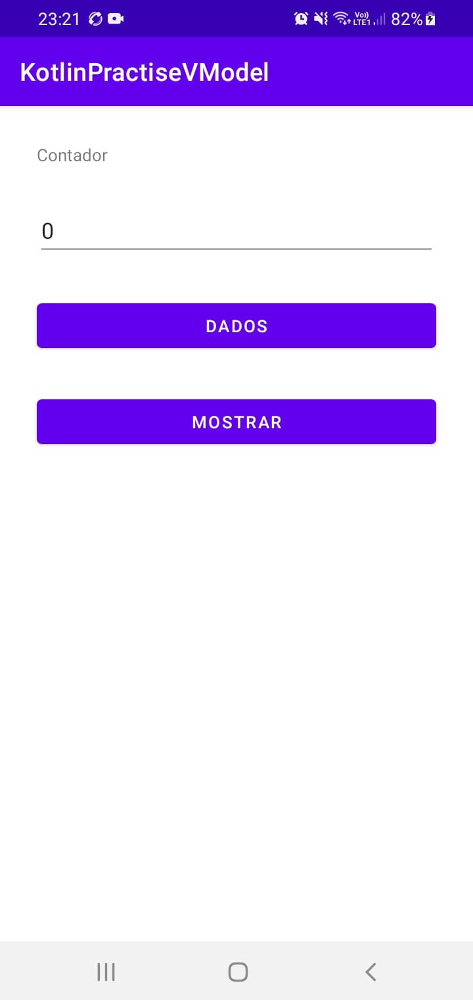

# Kotlin Practice View Model

- Instrutor: Leandro Martins
- Plataforma de Ensino: https://digitalinnovation.one/sign-up?ref=K5EF2VCVKA
- Módulo ViewModel e Lifecycle para Melhor Experiência em Aplicativos Android

## Vídeo Explicativo

[Youtube](https://youtu.be/za8kp5w33Ks)

##  Objetivo

- Aplicação destinada à prática do módulo ViewModel e Lifecycle para Melhor Experiência em Aplicativos Android.
- Demonstração do LifeCycle de uma Activity (commit: add testing lifecycle functions).
- View Models nos permitem modelar várias entidades a partir de um ou mais modelos em um único objeto. 
- App inicializa com a variável contador com o valor 0. A cada clique no botão Dados, incrementa o valor da variável contador em + 1. Regra de negócio: Se contador maior que 5, variável contador reinicia para o valor 0. O botão Mostrar exibe uma mensagem com o valor atual da variável contador.

## Tecnologias Utilizadas

- Kotlin
- TypeScript
- Live Data
- View Model

## Conteúdo apresentado

- Conceitos básicos do padrão de arquitetura
- Preparando o projeto e criando o layout
- Regras de negócios
- Ciclo de vida de uma activity - Teoria
- Ciclo de vida de uma activity - Prática
- Implementação e Live Data - Teoria
- Implementando library e desenvolvendo a classe MainViewModel

## Autor

- Bruno Gamba Rocha
- https://www.linkedin.com/in/bruno-gamba-rocha/
